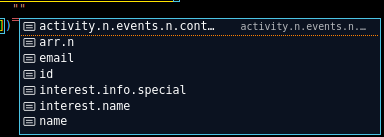

### useSearch

Filter and optionally sort objects by nested values against a query.

### Installation

`yarn add @lindeneg/search`

---

#### Arguments

| Name      | Required | Ref | Type                                                                     | Description                                                    |
| --------- | -------- | --- | ------------------------------------------------------------------------ | -------------------------------------------------------------- |
| data      | Y        | T   | `Array<Record<string \| number \| symbol, unknown>>`                     | array of objects to filter                                     |
| predicate | Y        | -   | `string[] \| (query: string, item: T[number], index: number) => boolean` | an array of property names to target or a predicate function   |
| sort      | N        | -   | `(a: T[number], b: T[number]) => number`                                 | optionally provide a sort function to be called post-filtering |

#### Return

Object with properties:

| Name          | Type                                                             | Description                                   |
| ------------- | ---------------------------------------------------------------- | --------------------------------------------- |
| filtered      | `T`                                                              | array of filtered, optionally sorted, objects |
| query         | `string`                                                         | current query used for filtering              |
| onQueryChange | `(target: string \| React.FormEvent<HTMLInputElement>) => void;` | function to change query                      |

#### Usage

```tsx
function SomeComponent() {
  const { filtered, query, onQueryChange } = useSearch(
    data,
    predicate,
    optionalSortFunction
  );
}
```

Suppose the following object:

```ts
interface User {
  id: number;
  name: string;
  email?: string;
  activity: { events: { context: string }[] }[];
  interest: {
    name: string;
    info: {
      special: string;
    };
  };
  arr: string[];
}
```

Say the interesting keys when filtering are `name` and `email`:

```ts
useSearch(users, ["name", "email"]);
```

Then the data will be filtered using the values of the `name` and `email` keys against a query.

Values found inside nested objects or arrays can also be used. Suppose the desired key to include is `context` found inside the `events` array that is itself found inside the `activity` array.

```ts
useSearch(users, ["activity.n.events.n.context"]);
```

Then the data will be filtered using the values of the `context` key against a query. `n` is used to describe that the current key is an index value, all items in the array will be considered.

Decent type-safety is also achieved, as can be seen in this example:

_the search depth is 5 layers, so `x.y.z.i.j` will be inferred while `x.y.z.i.j.k` will not_


